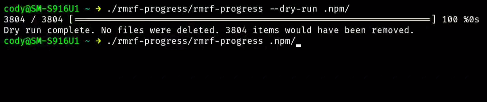

# rmrf-progress

A command-line utility that provides progress tracking and safety features for recursive file deletion operations.

<p align="center">
  
</p>

## Features

- Real-time progress bar with completion percentage and ETA
- Dry-run mode to preview deletions without executing them
- Confirmation prompt for destructive operations
- Verbose output option for detailed logging
- Safety checks to prevent accidental deletion of root or current directory
- Graceful error handling for inaccessible files

## Installation

### From Source

```bash
git clone https://github.com/Cod-e-Codes/rmrf-progress.git
cd rmrf-progress
go build -o rmrf-progress main.go
```

## Usage

```bash
rmrf-progress [options] <target-directory>
```

### Options

- `--dry-run`: Show what would be deleted without actually deleting anything
- `--verbose`: Print each file path as it's processed
- `--force`: Skip the confirmation prompt (use with caution)

### Examples

Preview what would be deleted:
```bash
rmrf-progress --dry-run /path/to/directory
```

Delete with verbose output:
```bash
rmrf-progress --verbose /path/to/directory
```

Force deletion without confirmation:
```bash
rmrf-progress --force /path/to/directory
```

## Safety Features

- Prevents deletion of root directory (`/`) and current directory (`.`)
- Requires explicit confirmation before proceeding with deletion
- Continues operation even when individual files cannot be accessed
- Processes files in reverse order (files before directories)

## Requirements

- Go 1.25.0 or later

## Dependencies

- [github.com/vbauerster/mpb/v8](https://github.com/vbauerster/mpb) - Progress bar library

## License

This project is licensed under the MIT License.
